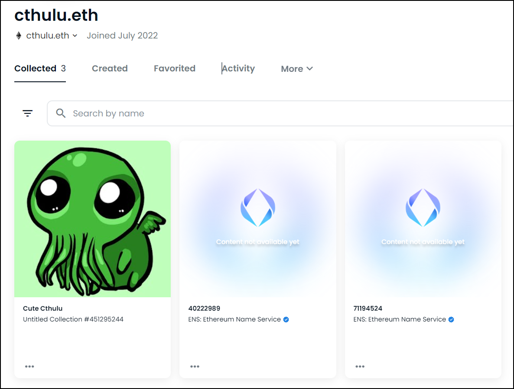
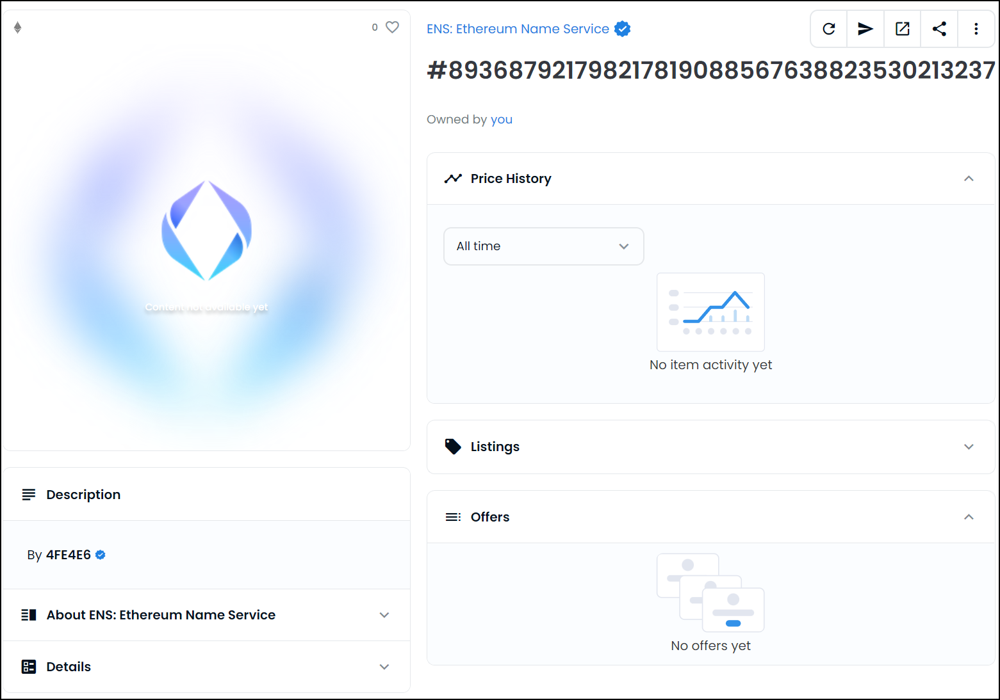

# Why doesn't my ENS name show?


* OpenSea is a third-party marketplace run by a separate private company and is unaffiliated with Ethereum Name Service.
* Ethereum Name Service does not have any access to OpenSea's systems.
* For problems that isn't addressed by this guide, OpenSea needs to be contacted directly. _(See_ [_OpenSea_](./)_)_


While ENS names appear and starts working immediately in the ENS app, it can sometimes take a much longer time for them to show on third-party marketplaces because they only update their internal databases every once in a while.

When you're experiencing this issue the ENS names will show up either as a series of digits, or as "Unknown ENS name". on OpenSea's website it can look like this:

This can usually be solved by using OpenSea's _refresh metadata_ feature.

* Click the _refresh metadata_-button for each of the ENS names that's affected:

This schedules a refresh of the metadata in OpenSea's internal databases and usually solves the issue in the next few hours.


OpenSea's systems are known to update very slowly and can sometimes take up to 24 hours to reflect changes.

If the ENS name still doesn't show up correctly after 24 hours you need to contact OpenSea's support for assistance. _(See_ [_OpenSea_](./)_)_


